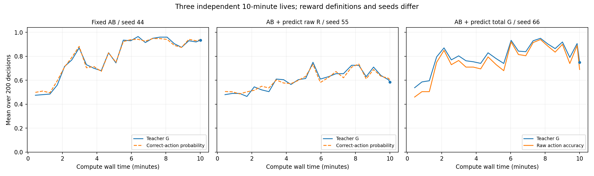

# ACNT 在线自修改训练：本对话实验总报告

整理日期：2026-10-02（Asia/Shanghai）。覆盖本对话中的在线训练、写入器、容量分析、规则切换、性能测试及三次十分钟连续运行。各阶段文件保留原来的 2026-10-01 文件名。本文由已保存的结果核验整理；此次整理没有重跑这些训练。

**当前得到的候选是：普通原版 Block + 独立向量 Write Adapter + 有界在线信用与自校准写入；最新实验把动作和自评价合成一个有界 Teacher goodness。** 小型合成任务上已有行为学习、自身写入、规则再次适应和评分预测的实测证据。三次十分钟运行都没有满足各自的末段平台判据，截止时成绩还不能当作稳定后的最终成绩。

## 研究约束与评分标准

- 从原版 Adapter → Core → Adapter 前向推导训练；没有将 G2 event-flow 参考动力学替换进这些原版实验。
- 每个实验生命内部时间单调推进，没有神经状态重置、参数回滚或经验重放；不同候选、种子和对照可以各自启动独立生命。相同种子前缀与确定性相同的对照不能重复计算为独立复现。
- 普通 Block 仍使用相同类型的前向算子；接上 Write 是连接角色，不是新增一种“学习 Block”。
- 后续全覆盖候选必须能修改全部实际有效参数，包括 Block 间连接、Write 和 Goodness Adapter。结构可写与某条轨迹实际写过多少坐标分别报告。
- 主体没有外部经历日记。z/固定 History 与参数承载状态；训练参考实现还保留固定规模 J/元敏感度、指数迹、矩和归一化统计。不能称为全部记忆只存在 Core H。旁观日志和诊断标签没有返送主体。
- 主要看充分探索、基本稳定后的末段 goodness。中途下降可以属于探索过程；预算截点或中间阶段截点不足以判定最终可达能力。数值有界、行为高分和长期能力保留是不同的证据。

这里“单向轨迹”是程序内的连续模拟轨迹：合成环境可反复提供提示机会，没有真实机械执行或不可恢复的资源损失。尚未覆盖一般现实不可逆世界。

## 从前向到当前训练候选

每个事件计算原版当前前向的局部 Jacobian，再传播固定大小数值信用：

\[
J_{t+1}=A_tJ_t+B_t,\qquad
e_t=\partial_\theta\log\pi(a_t\mid s_t)
       +(\partial_s\log\pi(a_t\mid s_t))J_t.
\]

写入器发展为 `F=tanh(Wz+b)`，各 F 有自己的读出权重行；资格迹 E 经过有界预处理，并由对应 F 调制实际参数写入。所有新增读出参数也纳入覆盖固定点。当前候选采用因果读出标准化、逐参数矩和有界更新；不是仅凭一个 goodness 均值直接决定全部参数。

F 的启动校准目标与信用规则仍由算法规定，actor F 校准使用 `2G-1`，控制区域学习正增益。完整生命周期传播停止穿过实际写入/统计的部分导数，并发生 J/迹/更新裁剪；不能称为模型已自行发现信用算法，或无偏的完整终生元梯度。细节见 [CALIBRATED_WRITE](../docs/training/CALIBRATED_WRITE.md)。

## 阶段实验一览

下表期望正确率指观察器计算的正确动作概率；它不是输入主体的额外标签。指标窗口和实验版本不同，不能据表直接进行单因素因果比较。

|阶段与问题|预算与配置|实测末段结果|能支持的判断|
|---|---|---|---|
|原版在线信用、已知固定延迟|seed 11/22/33，各 2,000 决策；按已知 34ms 延迟匹配动作信用|最后 100 期望正确率 0.9958 / 0.9961 / 0.9904，实际 1.00 / 1.00 / 0.99|完整状态信用与时间归因在该协议中有效；保存有限动作匹配信息的版本不符合后续“无经历账本”最终候选|
|原版匿名、重叠、随机延迟|同三种子，各 2,000 决策|最后 100 期望正确率 0.4820 / 0.7199 / 0.5261|该预算内未获得可靠高末段；不能以中途峰值声称稳定，也没有证明永远不能学会|
|自修改启动、局部目标写入|只写 33 个行为参数；控制器 526 参数；三种子各 1,000 决策|恒定目标末 100 期望正确率 0.9837 / 0.9828 / 0.9816；条件任务 seed 11 为 0.4984，提速后 0.4969|标量反馈可启动有用写入；常量成功不能覆盖条件动作问题；本版尚非全参数自覆盖|
|信号链路与增量写入诊断|seed 11，按前 700 / 后 300 做旁观诊断|无写入 Hand z 的诊断分类 100%；旧 target 写入 53%；delta 写入 96.7%，主体后 300 期望正确率仍 0.4840|提示确实到达 Hand；可读表示不等于主体已学会读出。监督 probe 仅供旁观诊断|
|按地址全参数写入|3,896 实际参数；Write 81 参数；每条 1,000 决策|常量末 100 实际 1.00；条件三种子期望 0.5246 / 0.5036 / 0.5000；全坐标均实际写过|地址执行与自身覆盖成立；共享地址生成器的训练/容量原因尚未分离，本组合未显示可靠条件收益|
|E × 分组 F 首轮|10 条记录；共享头 3,122 参数 / Write 81；独立头 3,756 / Write 715 / F143|Core F 条件末段多在约 0.5；独立头 0.5027；统一教师、RMS、短迹对照最多约 0.5746|全覆盖分组可执行；该训练组合不能否定所有分组方向方案。独立头也不能在不匹配预算时单独排除容量问题|
|自校准独立向量 Write|12 条记录、18,000 决策、72,000 事件；g32、短迹 0.1ms|固定条件任务三种子末 100 期望 0.999850 / 0.999916 / 0.999884，实际均 1.00|当前训练组合可学条件动作，并实际写入全部 715 个 Write 参数；多项训练改动的联合结果|

原版固定延迟对照（seed 11、1,000 决策、最后 100）为：完整 0.9845、切断状态信用 0.5012、冻结 Core 0.5022、同世界匿名迹 0.5033、清空延迟迹 0.4997。这支持本任务中的状态信用与归因作用，不能推广为一般必要性定理。

自校准候选切断校准、禁止写入、取消归一化的末 100 正确动作概率分别为 0.5300、0.5434、0.4978；长迹 pilot 的 Core F 为 0.4700。短迹成功不验证未知/长延迟奖励。

## 规则切换：A → B → A

三种候选各在新生命中跑 3,000 决策，每段固定 1,000；阶段标签不输入主体。回到 A 后重新适应，不等于已证明 A 无遗忘。

|候选|各阶段末 100 正确动作概率|全轨迹最后 500 实际 G / 正确动作概率|解释|
|---|---|---|---|
|原速率、ReLU（switch_v1）|0.999850 / 0.460850 / 0.999963|1.000 / 0.999952|末段观察到高值；中间 B 阶段截点不是 B 最终可达成绩|
|慢 Core + LeakyReLU（continual_v1）|0.999995 / 0.999995 / 0.479987|0.508 / 0.507991|本次截止时约随机；不证明继续学习后不能恢复，两项改动不能单独归因|
|持续探索（exploration_v1）|0.952574 / 0.639158 / 0.952574|0.964 / 0.952574|末五个 100 次窗口处于高值；动作概率限制使正确动作概率上限约 95.26%|

探索版按动作前 raw logit 设置 `T=max(1,abs(q)/3)`，保证任一动作概率至少 sigmoid(-3)≈4.74%。信用对已选 T 条件求导、停止 T 选择导数，是额外近似。固定阶段长度尚未做到等待稳定后再切换。

## 三次十分钟连续生命

均使用合成四采样 A/B 提示，提示后两次继续前向，再采样二元动作并即时反馈；每决策四个事件，CPU 单线程。每个事件模拟时钟推进 2ms。十分钟是实际计算时间，三条生命的模拟时钟分别累计约 37.750 / 37.166 / 37.382 秒，不是十分钟真实声学互动。

|版本 / seed|实际秒 / 决策|参数 / Write / F|末 1,000 Teacher G|末 1,000 动作正确率|评分预测 MSE|末段平台|
|---|---|---|---:|---:|---:|---|
|固定 AB / 44|600.07 / 4,719|3,756 / 715 / 143|0.914000|91.4%|—|未满足|
|AB + 独立 BCE 评分 / 55|600.03 / 4,646|3,839 / 740 / 148|0.652000|65.2%|0.127824，相对原始 R|未满足|
|AB + 有界合成总 G / 66|600.11 / 4,673|3,839 / 740 / 148|0.845592|81.1%|0.016041，相对最终 G|未满足|

seed 55 的 Teacher G 只有动作原始分，评分 BCE 是另一个信用目标；它是用户修正要求前的历史版本，不符合最终“单一合成总 goodness”定义。seed 66 替换 Teacher 及评分信用，评分头先输出 p，再计算最终 G；没有另给学习器原始 R 标签。两次预测的目标不同，MSE 不能直接视为相同任务的改善倍数。换种子、评估 Core 信用/学习率及训练函数的联合改动也不能独立归因。



图中使用完整 200 次决策窗口，末尾追加实际最后 200 次窗口（可能与前窗重叠）；圆点对应预算截止时的末 200 次总 G，避免丢掉末尾不足整箱的决策。

### 最新版本的数学

\[
B=0.2+0.8R,\quad G=B-0.2(p-G)^2,\qquad
G=p+\frac{2(B-p)}{1+\sqrt{1+0.8(B-p)}}.
\]

一般参数条件为 `0<b<1, 0≤λ≤b, λ<1/2`。右侧将 [0,1] 映回自身且压缩常数 ≤2λ<1，因此存在唯一有界根。λ>0 时，评价修正 Δ=-λ(p-G)² 在 p=G 时严格为零；本轮正确动作 G≥0.8、错误动作 G≤0.2。R=0 时必须预留扣分空间，故准确预测错误动作的最终目标是 0.2。

设 p=sigmoid(q)，评价即时信用系数是 `2λ(G-p)/(1+2λ(G-p))*p*(1-p)`，只需自身 p 和单一收到的 G。它是 Teacher 函数的精确局部导数，不是完整终生训练梯度。零评价修正不要求其他任务信用或历史动量同时停止。完整证明见 [BOUNDED_TOTAL_GOODNESS](../docs/training/BOUNDED_TOTAL_GOODNESS.md)。

全程 G 范围 **[0.0018372224, 0.9999999990]**，最大方程残差 1.73e-16。最初 200 次总 G / 预测 MSE 为 0.537798 / 0.151008；最后 200 次为 0.749778 / 0.011109；最后 1,000 次平均评价扣分 -0.003208。末段 A/B 动作正确率分别为 94.92% / 66.60%。两路输出对各自合成 G 的 MSE 0.025977，动作对错分类 95.85%；未选动作的 Teacher 仅由观察器事后计算，没有另试动作或返送标签。

实际写过 3,727/3,839 坐标，包括 Goodness 58/58 与 Write 740/740。持久状态及训练张量 1,877,915 字节、进程峰值工作集约 610.3MB；J 裁剪 1,688 次，更新裁剪 2,142 次，最终状态全部有限。固定大小数值状态不随经历增加，不等于总资源成本低，也不保证未来永远不崩。

## 结构预算与本机选择

对于 N 个 Write 输入神经元、M 个独立 F、基础参数 P0、每个 F 最多覆盖 g 个参数：

\[
P_W=(N+1)M,\quad P=P_0+(N+1)M,\quad
gM\ge P\iff(g-N-1)M\ge P_0.
\]

P0>0 时，有限自覆盖要求 **g>N+1**。当前不跨张量打包的最小固定点为 `M=A+ceil(NM/g)+ceil(M/g)`，A 为基础各张量的组数。该不等式是结构覆盖条件，不是训练收敛条件；FP32 存储位数也不等于可学习的独立比特控制能力。

七个等宽原版 Block 的基础参数公式 `P0(N)=98N²+364N+17` 包含全部 49 条 Block 连接，其中 42 条跨 Block 参数为 84N²、7 条自连接为 14N²。g32、最小 F、沿等宽扩展路径的最大宽度 N=30：210 个 Core 神经元、F100,672、Write 3,120,832、总参数 3,219,969；稠密参考状态约 10.9GB。这是特定结构路径的预算，不是所有 ACNT 的绝对参数上限；放开 F 和 Block 数量后仅靠覆盖条件没有有限总参数上界。

关于 g 的有效信用上限，联合高斯、组内相关性 ρ 的假设下，一阶平均收益比为 `sqrt(ρ+(1-ρ)/g)`；保留至少一半收益且 g32 要求 ρ≥0.225806。ρ 是未在 ACNT 上验证的假设，不能把该式当作实测最佳分组。相同 E 不足以推出相同 F，因为真实参数梯度/后续因果作用可以不同。

本机基准只是速度测量：Ryzen 9 9950X、32GB RAM、RTX 5080；当前稠密训练跑 CPU，未适配 GPU。3,756 参数 / 28 Core 神经元单线程约 0.1244秒/决策，100k 决策估计 3.46小时；12,936参数四线程约 0.3484秒/决策，估计 9.68小时；31,549与66,085参数单线程分别约2.01与5.83秒/决策。实际任务开销会变化，不能把估算当作已运行十小时结果。长期主候选因此先选小模型；计划见 [LOCAL_LONG_TRAJECTORY_PLAN](../docs/training/LOCAL_LONG_TRAJECTORY_PLAN.md)。

## 证据、验证与复现

各阶段汇总器重新运行通过，核对保存轨迹、指标及当前/保存源码 SHA256，没有启动新训练。最新完整回归 **265 项通过**；检查包含原版前向一致性、在线信用有限差分、全部参数写权限及自身写入、固定资源、单调时间、独立二分求根、G 网格边界、零评价修正和数值导数。

GitHub 包含学习与实验代码、测试、算法文档、各阶段 Markdown/PNG/SVG/JSON、去除逐决策 rows 的记录及按 SHA256 存储的执行源码版本。原始逐事件日志与 `.pt` 最终状态保留本地且没有返送主体。旧源文件的备份不替换当前代码；记录到源版本的映射见 [manifest.json](acnt_self_write_session_2026-10-02/manifest.json)。公开精简记录足以核对配置与保存的汇总，但重新检查逐事件轨迹仍需本地完整日志。

新 checkout 可不依赖本地 runs 核对公开包：

```powershell
python -m pip install -e ".[test,reports]"
python -m experiments.summarize_session --verify-published
python -m pytest -q
```

新生命复现三种十分钟任务（运行会消耗各十分钟；输出目录必须为新目录）：

```powershell
python -m experiments.calibrated_write_duration --seconds 600 --seed 44 --width 4 --threads 1 --output runs/reproduce_ab
python -m experiments.calibrated_write_duration --seconds 600 --seed 55 --width 4 --threads 1 --self-evaluate --output runs/reproduce_raw_goodness
python -m experiments.calibrated_write_duration --seconds 600 --seed 66 --width 4 --threads 1 --bounded-total --output runs/reproduce_total_goodness
```

墙钟预算导致决策数依赖硬件；严格历史版本以 manifest 映射的源码为准，训练状态不会因新版本得到追溯性修改。各阶段的更多对照与命令见下列分报告。

## 分报告索引与历史材料

|材料|报告|算法|
|---|---|---|
|原版在线与固定/匿名延迟|[原版在线](original_acnt_online_2026-10-01.md)|[ORIGINAL_ACNT_ONLINE](../docs/training/ORIGINAL_ACNT_ONLINE.md)|
|局部自修改启动|[自修改启动](self_write_bootstrap_2026-10-01.md)|[SELF_WRITE_BOOTSTRAP](../docs/training/SELF_WRITE_BOOTSTRAP.md)|
|信号链路和增量写入|[输入诊断](self_write_input_diagnostic_2026-10-01.md)|[实现](../acnt/self_write.py)|
|地址写入|[地址写入](address_write_online_2026-10-01.md)|[ADDRESS_WRITE_BOOTSTRAP](../docs/training/ADDRESS_WRITE_BOOTSTRAP.md)|
|首轮分组方向|[分组写入](grouped_write_online_2026-10-01.md)|[GROUPED_WRITE_BOOTSTRAP](../docs/training/GROUPED_WRITE_BOOTSTRAP.md)|
|自校准、对照与规则切换|[校准写入](calibrated_write_online_2026-10-01.md)|[CALIBRATED_WRITE](../docs/training/CALIBRATED_WRITE.md)|
|固定 AB 十分钟|[seed 44](calibrated_write_10min_2026-10-01.md)|[本机计划](../docs/training/LOCAL_LONG_TRAJECTORY_PLAN.md)|
|旧独立评分十分钟|[seed 55](goodness_prediction_10min_2026-10-01.md)|[实现](../acnt/goodness_prediction.py)|
|有界合成 G 十分钟|[seed 66](bounded_goodness_10min_2026-10-01.md)|[数学证明](../docs/training/BOUNDED_TOTAL_GOODNESS.md)|
|参数与神经元预算|[结构计算 JSON](write_structure_limit_2026-10-01.json)|[WRITE_VECTOR_BUDGET](../docs/training/WRITE_VECTOR_BUDGET.md)|
|g 假设上限、位打包/组相容性|[g 假设](write_group_limit_2026-10-01.json)、[可行性诊断](grouped_write_feasibility_2026-10-01.json)|[GROUPED_DIRECTION_WRITE](../docs/training/GROUPED_DIRECTION_WRITE.md)|
|CPU 速度与资源|[单线程基准](calibrated_write_benchmark_2026-10-01.json)、[四线程基准](calibrated_write_benchmark_4_threads_2026-10-01.json)|[基准脚本](../experiments/calibrated_write_benchmark.py)|

仓库已有的 [短窗 BPTT 基线](original_acnt_training_2026-10-01.md) 保留为对照前身，不等同于上述连续自修改候选。更早 G0–G3 event-flow 交接属于独立参考线：本地 G0/G1/G2 smoke 数字见 [INTEGRATION](../docs/training/INTEGRATION.md)；[reported_chat_results](training_handoff_2026-10-01/reported_chat_results.md) 仅是原聊天报告，没有同等逐轨迹证据，不计入本轮持久实验。原交接 manifests 描述源压缩包，而非当前集成代码；G3 未通过。

下一步仍是足够长的连续轨迹、多种子、多规则与延迟反馈，并按稳定末段而非中途峰谷评分。本报告支持当前小模型的长期在线学习潜力，尚不验证一般长期保留、百万参数训练或无限时间稳定性。
