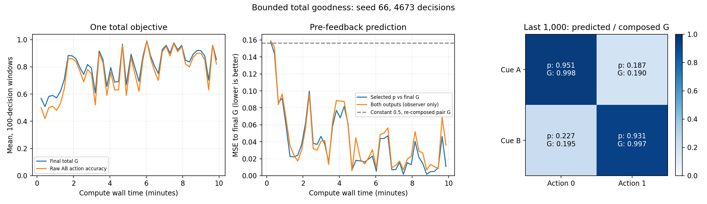

# 有界总goodness：十分钟实验

独立种子66生命，实际计算600.11秒，4673次决策、18692次前向事件。

本轮动作与评分任务共同使用一个Teacher总G。评分头在当前反馈前预测最终G。

## 数学定义

`B=0.2+(1-0.2)R; G=B-0.2(p-G)^2`，取[0,1]内唯一根。
右侧映回[0,1]且压缩常数最多0.4；评价修正为`G-B`，p=G时严格为0。正确动作总G至少0.8，错误动作总G最多0.2。错误动作预测准确时目标为0.2，这是预留扣分空间的主任务评分刻度。证明、闭式根和导数见[数学文档](../docs/training/BOUNDED_TOTAL_GOODNESS.md)。

实测全程G范围：[0.001837222379070913, 0.999999998993829]；最大方程残差1.73e-16。

## 学习路径

Teacher内部用动作原始分R与评分头输出p合成G。传给Core、actor F校准及评价信用的仅是G；R只在观察器中，不作额外BCE标签。评分信用系数为`2λ(G-p)/(1+2λ(G-p))*p*(1-p)`，乘反馈前保存的评分logit在线信用，再由Write相应F控制实际写入。它是合成G的局部导数。

仍为7个普通Block、28神经元、3839参数、148个F；Goodness Adapter58参数，Write740参数，全部实际参数包含Block间连接并保持可写。其他学习率与上一双任务候选相同。

## 实测成绩

|区间|总G|动作正确率|预测最终G的MSE|平均评价修正|
|---|---:|---:|---:|---:|
|最初200次|0.537798|0.4600|0.151008|-0.030202|
|最后200次|0.749778|0.6900|0.011109|-0.002222|
|最后1000次|0.845592|0.8110|0.016041|-0.003208|
|全程|0.797879|0.7569|0.038209|-0.007642|

末段两路评分对各自最终G的均方误差：0.025977；两路判动作对错的正确率：0.9585。两路分数来自同一前向输出；未选动作的Teacher公式仅供观察器计算，没有实际另试动作或反馈标签。

末段最佳常数拟合记录中G的MSE为0.098166。这是事后回归基线；改变预测本身会改变Teacher合成G，不能把此基线当作实际奖励干预结果。

## 连续性与验证

无重置、回滚、经验重放或外部optimizer。全行合成公式、G范围、零点数学检查、即时信用导数、源文件快照与最终状态均校验通过。

本轮完整测试套件265项通过；其中包含独立二分求根、输入网格边界、零修正与局部导数数值验证。

实际写入3727/3839参数；Goodness参数58/58，Write参数740/740。持久状态及训练数值张量固定1,877,915字节，进程峰值工作集约610.3 MB。

最终状态有限；J裁剪1688次，更新裁剪2142次。Core H以外仍有J、指数迹、矩与归一化统计，不能说全部记忆仅在Core H。

末段总G平台判据满足：False；判据为last 1000, five 200-decision windows: total G range <=0.05 and total G endpoint change <=0.01。中间下降仅作观察；未满足平台条件不等于已证明长期学习机制失败。

## 解释边界

本次改了Teacher函数及评分信用，并换用新种子，不能与旧双任务分数作单因素因果比较。只有一条固定AB、即时反馈合成任务；不覆盖多任务、延迟奖励或一般长期保留。Teacher函数的局部导数虽精确，生命周期训练仍有停止导数、J/更新裁剪和信用归一化等近似。

十分钟为计算时间，单调模拟事件时钟累计37.382秒。观察日志与最终状态只供事后检查，没有提供给学习器。

原始结果：runs\calibrated_write_duration\bounded_total_seed_66_600s_v1/result.json；最终状态：final_checkpoint.pt；源码：source_snapshot。
原始结果SHA256：`4f93e14c23e465cb2c8e98412c24ebfd5a1701d9b4b05aa3ab2da29d5243ecb3`。
