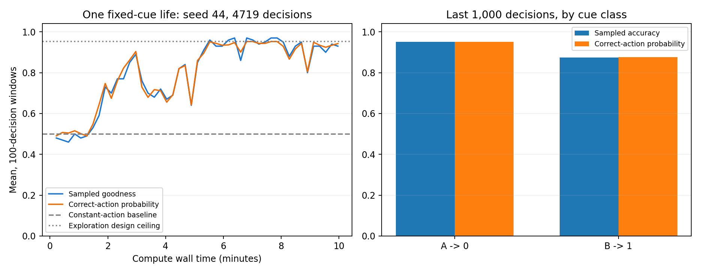

# 十分钟固定规则在线学习实验

新种子44的一条连续生命，实际计算600.07秒，4719次决策、18876次前向事件。

最后1000次实际goodness均值 **0.914**，正确动作概率均值 **0.914551**。

末段五个200次窗口是否满足预设平台观察条件：**False**。这是有限窗口观察，不代表数学收敛。

## 任务与算法

两类合成信号，幅度随机，A选择0、B选择1，各以约一半概率独立出现。输入在第一次前向事件到达，第四次事件先采样动作再接收标量G；规则、类别编号和正确动作只在环境/观察器中使用，模型接收信号、自身动作和G。

7个普通Block，每个4个神经元。全部3756个实际参数包括Block之间的连接；Write有715参数、143个独立F。保留慢Core、Leaky Hand和置信度限制探索版，没有在生命中更换算法或超参数。探索使正确动作概率最多约0.9526。

## 实测成绩

|区间|次数|实际G均值|正确动作概率均值|
|---|---:|---:|---:|
|最初200次|200|0.4750|0.498993|
|最后200次|200|0.9350|0.938475|
|最后1000次|1000|0.9140|0.914551|
|全程|4719|0.7987|0.801965|
|末段A|515|0.9515|0.950817|
|末段B|485|0.8742|0.876041|

最后五个200次窗口：

|窗口|实际G均值|正确动作概率均值|
|---|---:|---:|
|1|0.9100|0.897769|
|2|0.9100|0.902791|
|3|0.9000|0.904174|
|4|0.9150|0.929544|
|5|0.9350|0.938475|

## 连续性与数值状态

生命内0次重置、0次经验重放、0次外部参数优化。源文件快照哈希、动作反馈、行数、模拟时钟与最终检查点均校验通过。日志及检查点仅供观察器事后使用。

实际发生过修改的参数坐标：3644/3756；其中Write自身为715/715。写入权限覆盖全部有效参数；本次未激活/零eligibility坐标未必产生实际修改。

额外状态及训练数值张量固定为1,792,192字节，进程峰值工作集约607.0 MB。J裁剪793次，更新范数裁剪3628次。有J、迹、矩和归一化统计等额外数值状态，不能说全部记忆都位于Core H。

最终状态检查为有限值；每100次及末尾抽样观察的最大值：{'neural_abs': 60.814788818359375, 'parameter_abs': 4.0, 'tangent_norm': 1000.0009155273438, 'interval_decisions': 100}。这些是抽样最大值，不能当作逐事件最大值。

## 解释边界

十分钟为实际计算时间；单调模拟时钟最后到37.750秒，没有按真实世界时间等待或接入麦克风。本次支持的范围是一个固定、即时反馈的合成条件选择任务；不覆盖规则反转、多任务、长期保留和匿名延迟奖励。

中间G下降作为探索过程记录，主要看稳定后的末段。规定的校准损失、条件温度求导及停止写入/统计导数等近似仍在，不能据此宣布一般长期学习已解决。

## 复现及产物

```powershell
python -m experiments.calibrated_write_duration --seconds 600 --seed 44 --width 4 --threads 1 --output runs/calibrated_write_duration/new_life
```

墙钟截点依赖本机负载，重跑的总决策数可以不同。原始轨迹为observer.jsonl，最终训练状态和随机数状态为final_checkpoint.pt，源码快照为source_snapshot。

原始结果SHA256：`4b55c70d5685cea106209f9b653553497442b408beb70f719743d2808997a3e4`。


