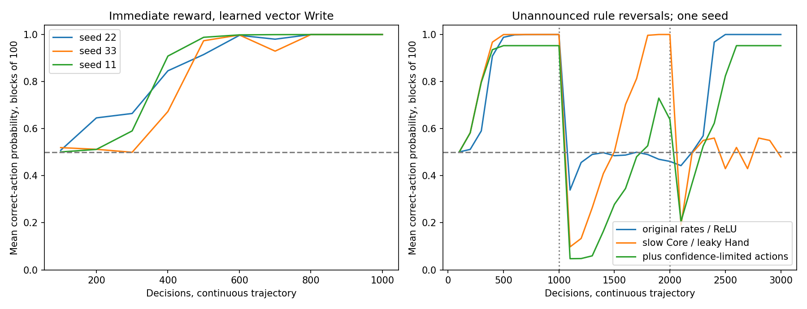

# 自校准向量 Write：实际实验结果

2026-10-01。这里汇总本次实际运行；汇总器校验轨迹长度、评分、源码 SHA256 和零重置。
汇总器读取这12条本次实际跑完的轨迹，不重新启动训练。普通 Block 保留原版前向；Adapter 新增因果标准化；信用定义已改变。



|配置|模式|任务|种子|决策|末100正确动作概率|末100采样准确率|末100 F 符号正确率|实际自写 Write 坐标|
|---|---|---|---:|---:|---:|---:|---:|---:|
|ablations_v1|cut_calibration|cue|11|1000|0.529967|0.530|0.530|0/715|
|ablations_v1|no_write|cue|11|1000|0.543366|0.600|0.602|0/715|
|continual_v1|core|switch|11|3000|0.479987|0.480|1.000|715/715|
|exploration_v1|core|switch|11|3000|0.952574|0.970|1.000|715/715|
|no_normalization_v1|core|cue|11|1000|0.497831|0.570|1.000|715/715|
|pilot_v1|broadcast|cue|11|1000|0.751718|0.730|1.000|715/715|
|pilot_v1|core|cue|11|1000|0.470017|0.470|1.000|715/715|
|short_trace_replicates_v1|core|cue|22|1000|0.999916|1.000|1.000|715/715|
|short_trace_replicates_v1|core|cue|33|1000|0.999884|1.000|1.000|715/715|
|short_trace_v1|broadcast|cue|11|1000|0.987944|0.980|0.980|715/715|
|short_trace_v1|core|cue|11|1000|0.999850|1.000|1.000|715/715|
|switch_v1|core|switch|11|3000|0.999963|1.000|1.000|715/715|

规则切换的每段末100次（包含重新适应；不等于保留旧任务）：

配置：switch_v1。

|阶段|规则|末100正确动作概率|末100采样准确率|
|---:|---|---:|---:|
|1|A|0.999850|1.000|
|2|B|0.460850|0.470|
|3|A|0.999963|1.000|

规则切换的每段末100次（包含重新适应；不等于保留旧任务）：

配置：continual_v1。

|阶段|规则|末100正确动作概率|末100采样准确率|
|---:|---|---:|---:|
|1|A|0.999995|1.000|
|2|B|0.999995|1.000|
|3|A|0.479987|0.480|

规则切换的每段末100次（包含重新适应；不等于保留旧任务）：

配置：exploration_v1。

|阶段|规则|末100正确动作概率|末100采样准确率|
|---:|---|---:|---:|
|1|A|0.952574|0.940|
|2|B|0.639158|0.660|
|3|A|0.952574|0.970|

## 按稳定末段评价最终 goodness

用户明确：探索期间的goodness下降可以是学习的一部分，不据此判定学习失效。
主要看充分学习后、基本稳定的末段goodness。之前“中间适应失败”的措辞撤回。
每阶段固定1000次的切换可能打断仍在适应的过程，阶段截点不是收敛证明。

|配置|最后500次实际goodness均值|最后500次正确动作概率均值|末段观察|
|---|---:|---:|---|
|switch_v1|1.000|0.999952|观察到稳定高值|
|continual_v1|0.508|0.507991|当前截止时仍约随机；不证明永远不能恢复|
|exploration_v1|0.964|0.952574|观察到稳定高值|

exploration_v1末五个100次窗口的实际goodness均值为0.97、0.96、0.95、0.97、0.97，
对应正确动作概率均值均约0.952574；观察到平台，并符合当前保留探索概率的设计上限。
因此本次3000次轨迹支持存在稳定高最终goodness；更长或其他环境仍未验证，
不能将尚未验证表述成已证明长期学习无效。


## 结论与范围

独立向量头共143个输出、715个参数；全部实际参数3756，均具有自写权限。
实际发生变化的总坐标少于3756时，表示这次轨迹未激活全部信用，不表示隐藏保护区域。
所有模式的origin固定、外部参数更新0、Core重置0；全部Write实际自写以表中计数为准。

校准目标明确由算法规定：行为F预测2G-1，校准组学习正增益，
资格迹中的控制参数使用负校准梯度。没有正确动作标签输入，但不能声称信用规则由Core自行发现。
行为F进入Adam风格动量；实际更新不是无记忆的eta*E*F。

短迹成功不能推广到原8/32/128ms长迹，不能推广到未知延迟奖励。
标准化、逐参数预处理、控制信用和头学习率均已改变，不能把改善归因于单一分组因素。
A→B→A是继续适应测试，不证明旧任务无遗忘。其前1000次与seed11单任务轨迹一致，不算额外独立复现。
continual_v1同时把Core学习率降为1e-5并把Hand激活改为LeakyReLU(0.1)，所有参数仍可写。
它是另一个独立实验生命，没有从先前轨迹回滚；两项改动一起测试，不能单独归因。
exploration_v1进一步在动作前按当前raw logit选择温度，保证两种动作概率均至少sigmoid(-3)。
因此正确动作概率上限约95.26%；条件score停止温度选择导数，额外增加4字节数值状态，不是精确完整policy梯度。
参数范围和写入范数有限不证明终身不崩；敏感度裁剪后信用近似，计数见JSON。

主体没有外部经历日记，但有额外固定大小的J、迹、动量和标准化状态；不冒充Core H。
字节计数不包含模型origin、固定映射元数据、单事件临时工作空间和峰值进程内存。

全量回归：248 passed；最初3项因系统tmp_path权限未执行，改用已验证的工作区临时目录后全部通过。

[算法](../docs/training/CALIBRATED_WRITE.md) · [运行](../experiments/calibrated_write_online.py) · [汇总](../experiments/summarize_calibrated_write_online.py)

复现即时反馈候选：

```powershell
python -m experiments.calibrated_write_online --seeds 11 22 33 --modes core --decisions 1000 --taus-ms 0.1 0.1 0.1 --output runs/calibrated_write_online/reproduce
```
