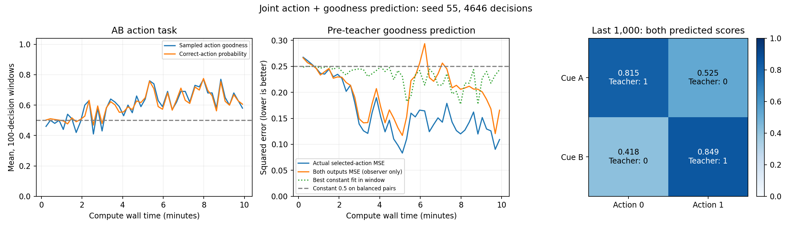

# AB动作与自评价双任务：十分钟实验

一条新种子55生命，实际计算600.03秒，4646次决策、18584次前向事件。

## 两个任务与因果顺序

动作任务为A选0、B选1。自评价任务输出g0、g1，分别判断当前输入下选0/1能否拿分。动作选定后、当前teacher G生成和交给模型之前，两路预测已经算完并记录。只用实际动作的teacher G监督对应输出；另一路只供观察器事后检验，不反馈标签。

系统goodness仍按动作是否正确提供。预测值没有替换系统G，也没有作为策略baseline、actor F目标或奖励调制量；它只进入自评价输出的teacher监督误差。辅助学习会改变共享网络未来的表现，这是双任务共同学习的实际影响。

## 结构与训练

仍为7个普通Block、28个神经元。现有普通Block 5接Goodness Adapter，结构为4→8→2，58个参数；输入只来自它的神经状态，当前动作通过选择输出通道体现。没有把输入类别、答案、teacher G或Hand概率直接塞给该Adapter。

全部3839个实际参数含Block间连接；Write为4→148、740参数。新增Goodness和扩容Write全部加入分组写入。原有Write行保留初始化，新增行独立初始化。

自评价训练使用teacher监督的BCE：负梯度为(G-p)乘反馈前捕获的所选logit信用。信用含直接参数项与在线J项，保存于三条指数衰减迹，生命内不留计算图。辅助信用仅写入Block 5和Goodness参数，由其对应正值F控制写入；既有校准训练仍更新Write等控制参数。所有有效参数均可写，没有外部optimizer。

Block 5从原动作信用分区改为评价分区，学习率为0.001；Goodness Adapter为0.01。因此这是新增任务及信用分区一起改变的候选，和此前种子44 AB版不构成单因素对照。

## 实测末段

|区间|动作G均值|所选评分MSE|两路评分MSE|两路判分正确率|
|---|---:|---:|---:|---:|
|最初200次|0.4800|0.264178|0.261564|0.4125|
|最后200次|0.5850|0.117281|0.164172|0.7425|
|最后1000次|0.6520|0.127824|0.184986|0.7325|
|全程|0.6009|0.163115|0.203690|0.6866|

最后1000次：所选预测MAE=0.251295，判分正确率=0.8140；总是预测得分的分类基线为0.6520。
同一末段最佳常数拟合MSE=0.226896，它利用了该窗口的结果均值，是事后描述基线，不是被试的前向预测。

按实际teacher结果分层：

|Teacher G|样本数|平均预测G|MSE|判分正确率|
|---|---:|---:|---:|---:|
|0|348|0.377719|0.218276|0.666667|
|1|652|0.816183|0.079545|0.892638|

当前输入的两路输出均值（观察器检验）：

|输入|选0预测|选1预测|Teacher规则|
|---|---:|---:|---|
|A|0.814737|0.524817|1 / 0|
|B|0.417737|0.849086|0 / 1|

## 连续性与限制

0次重置、重放或外部参数优化。源代码快照、行数、teacher反馈、预测通道、统计误差和最终状态均校验通过。日志与最终检查点没有提供给学习器。

曾实际写入3727/3839坐标，Write自身740/740；新增Goodness参数58/58；有限训练数值张量固定1,877,915字节。最终均为有限值，J裁剪1222次，更新裁剪1682次。

除Core H外仍有有限J、指数迹、矩和归一化统计，以及当前尚待反馈的一项预测标量。这些不是经验日记，但需要披露，不能说全部记忆只有Core H。

十分钟是计算时间，事件时钟为单调模拟时间；仅一个固定规则、即时反馈合成任务。中间回落不作为机制失败。当前预设平台指标只评估动作任务，不能据此宣称评分头已收敛。BCE、校准目标、信用分区和部分停止导数为人为规定的训练机制；本轮没有让模型自行产生或替换goodness effect。

动作末段平台判据满足：False。

新增四项因果顺序、系统评分隔离、指数迹和全参数可写性检查通过；全套回归253项通过（系统临时目录拒绝访问后，使用工作区新目录完成）。

原始日志、结果及最终训练/随机数状态在实验目录；执行源码以source_snapshot为准。
原始结果SHA256：`2e8941963b0af4e986de220b9de93859df6bab52d164cd6beb33307051cb4bf2`。
