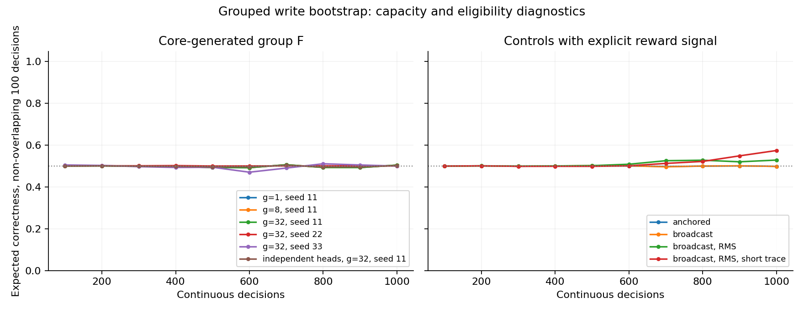

# E × 分组 F：首轮结果

2026-10-01。十条独立单向轨迹，每条 1,000 次决策、4,000 个事件。
实际执行了训练，主体不重置、不反事实重放、不读取观察者日志。

**结论：全参数分组执行和自身写入路径成立；本轮 Core 生成的 F 尚未学会条件任务。**

先去掉 Hand 中未用于二元任务的 774 个参数，保留原已用输出的精确初始映射。
共享版总参数 3,122、Write 81；每组最多 32 个参数时只有 125 个 F。
独立输出头的自身参数也纳入预算：总参数 3,756、Write 715、143 个 F。

|配置|种子|Write参数|F数|末100期望正确率|末100采样正确率|自身实际写过/可写|
|---|---:|---:|---:|---:|---:|---:|
|共享头 / Core F / g1|11|81|3122|0.5046|0.5700|81/81|
|共享头 / Core F / g8|11|81|392|0.5046|0.5700|81/81|
|共享头 / Core F / g32|11|81|125|0.5048|0.5700|81/81|
|共享头 / Core F / g32|22|81|125|0.5009|0.5400|81/81|
|共享头 / Core F / g32|33|81|125|0.5001|0.5400|81/81|
|独立输出头 / Core F / g32|11|715|143|0.5027|0.5900|564/715|
|anchored|11|81|125|0.4989|0.5800|81/81|
|broadcast|11|81|125|0.4987|0.5800|0/81|
|broadcast / RMS|11|81|125|0.5289|0.6100|0/81|
|broadcast / RMS / 极短迹|11|81|125|0.5746|0.6600|0/81|

## 容量假说能判断到哪里

把查询从 3,122 个减少到 392/125 个，未出现条件任务学习收益；增加为每组
独立系数的 715 参数输出头，同样未解决本轮任务。权限测试覆盖所有实际坐标，
包含所有 Write 坐标，实际轨迹中是否修改某个坐标还取决于其 E 是否非零。
不能把“可写”混同为“每个参数都应该在每轮修改”。独立头实际自写 564/715，
不声称轨迹中每个自身参数都已经获得有效信用。

这些结果不排除容量不足：共享头仍是共同函数，独立头只测一个种子、
且每参数反馈量从约 12.35 降为约 1.40，并未匹配训练自由度后的反馈预算。
反馈/参数比是预算描述，不是判断收敛的定理。当前只有学习机制探测，
没有严格的容量/数据量因果结论。

## 为什么暂不判定分组方向失败

统一 G 调制对照也未学会条件任务；RMS 和极短迹诊断有一些改善，仍未
达到稳定可靠的条件动作。其成功或改善也不能归因于 Core 自行分配信用。
因此需要先校准 E 的有效方向、时间混合、写入幅度和反馈信用，再比较
控制器容量。不能单凭这一训练组合的负结果否定生理类比或所有分组方案。

RMS 保留原 E 递推，但更改幅度转换及 nominal eta；极短迹另改时间常数。
这两个是独立诊断，不属于只改分组的干净比较。

## 机制和局限

同组共享 F；最终增减仍由有符号 E 决定，F 是沿 E/反 E 的区域调制。
E 的指数递推保留；actor score 与包含写入路径的 writer score 的结合是
本轮混合近似，不称为已证正确的全系统资格迹或钙浓度模型。
外部 Write bootstrap 仍存在；它不直接更新行为参数。Core F 不读直接 G 旁路，
anchored/broadcast 则明确读取 G；不能把后两者结果称为自主分析 G。

稳定性依赖明确的参数/更新/迹/敏感度限制；无非有限数不证明长期稳定。
神经活动量、延迟反馈、任务切换、长期遗忘和现实身体后果尚未验证。

所有候选包含全参数分组映射，没有永久只读的可训练控制网络。
主体只有当前 Core 状态、参数位移和固定规模训练数值状态；
没有动作/反馈历史槽、经验回放或外部经历日记。

## 验证与资源

全仓 240 项测试通过。新增验证包括同组 F、全部坐标权限、保持原动作映射、
真实 self-write 信用、资格迹递推、固定权重 actor 梯度、条件自写导数、
RMS 保持原始 E、独立输出头自覆盖固定点、固定资源等。

共享主体/训练张量固定为 2,510,008 bytes；RMS 为 2,534,984；独立头为
12,826,456。另有模型、地址/索引和单事件工作空间，未测峰值进程内存。
J/T 是额外数值状态，不冒充普通 Core H。

[机制说明](../docs/training/GROUPED_WRITE_BOOTSTRAP.md) · [汇总数据](grouped_write_online_2026-10-01.json)

## 原始数据

以下为本地完整记录路径，未上传逐决策日志。公开精简记录与源码版本见
[本对话证据包](acnt_self_write_session_2026-10-02/manifest.json)。

- `runs/grouped_write_online/group_controls/cue_seed_11_g1_core.json`
- `runs/grouped_write_online/group_controls/cue_seed_11_g8_core.json`
- `runs/grouped_write_online/core_g32/cue_seed_11_g32_core.json`
- `runs/grouped_write_online/core_g32/cue_seed_22_g32_core.json`
- `runs/grouped_write_online/core_g32/cue_seed_33_g32_core.json`
- `runs/grouped_write_online/independent_capacity/cue_seed_11_g32_independent.json`
- `runs/grouped_write_online/reward_controls/cue_seed_11_g32_anchored.json`
- `runs/grouped_write_online/reward_controls/cue_seed_11_g32_broadcast.json`
- `runs/grouped_write_online/rms_diagnostic/cue_seed_11_g32_broadcast_rms.json`
- `runs/grouped_write_online/short_trace_diagnostic/cue_seed_11_g32_broadcast_rms_short_trace.json`
