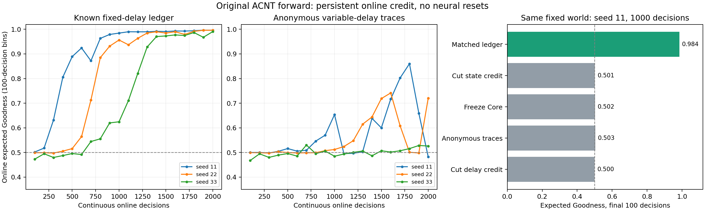

# 原版 ACNT 在线训练：推导与实验结果

日期：2026-10-01。实现从原版 Adapter → Core → Adapter 前向出发。
本报告中的成功结果需要**已知固定反馈延迟**；匿名延迟版本未表现出稳定学习。
下文保留原版在线训练阶段的结果。后续自修改 Adapter 已实现并实验，
完整路线见 [本对话总报告](acnt_self_write_session_2026-10-02.md)；不能将本阶段成绩当作后续自修改的验证。

## 已实现的算法

将所有 Block 的 z 和保留的预激活 History 一起作为状态 s。
每个事件只求当前原版前向的局部导数，沿时间传播数值敏感度：

\[
J_{t+1}=A_tJ_t+B_t,\quad A_t=\partial_sF_t,\quad B_t=\partial_\theta F_t.
\]

实际随机动作的信用向量为：

\[
e_t=\partial_\theta\log\pi(a_t|s_t)+(\partial_s\log\pi(a_t|s_t))J_t.
\]

已知延迟版本保存动作时的 e 和基线 b；反馈到达后按物理时间匹配，
以 (G-b)e 进行有界更新。匿名版本保留指数衰减的多时间尺度信用迹。
更新后继续使用实际发生的 z、History、时间戳和信用，没有重置神经状态。
所有跨事件保存的信用均为无计算图的数值张量。

固定参数、未截断时，J 是准确导数。参数持续更新时，本实现对已经实现的
参数日程使用 stop-update 切线，**没有求穿过学习器自身更新的完整元梯度**。
实验还截断 J、动作信用和更新幅度，因此不能宣称准确的终生梯度。

实现：[original_online.py](../acnt/original_online.py)。
完整公式、资源成本和协议：[ORIGINAL_ACNT_ONLINE.md](../docs/training/ORIGINAL_ACNT_ONLINE.md)。

## 实验条件

- 六个原版器官 Block 保留；width=4，hold_tick=4，私有 NLM 隐层宽度=2。
- 通过 Ear 读入随机二值提示，3 个事件后采样一个 Hand 离散坐标。
- 所有 Block 激活，Route 固定；行为任务未训练 Eye、Speak、连续 Hand 或 Route。
- 环境隐含判断动作是否正确，学习器只收到标量 Goodness，不收到目标标签或动作 ID。
- 固定延迟为 17 个事件、模拟时间 34ms；时间合同允许按到达时间减延迟匹配历史动作。
- 每个主实验 2,000 次决策、10,000 个连续事件，零重置、零重放。
- 时间戳是单调推进的模拟逻辑时钟。世界有重复提示机会，无真实机械执行或不可恢复的资源损失。
- 末段指标取最后 100 次在线决策，不是重置后另跑的测试集。

这里的期望 Goodness 是环境事后计算的动作正确概率，供评估使用；未提供给学习器。
实际动作仍随机采样，两者必须区分。未到达的反馈在预算结束时不被额外清空。

## 主结果：已知固定延迟

| seed | 初段期望 G | 末段期望 G | 末段实际正确率 | 已收到反馈/更新 | 跨其他更新的反馈 |
|---|---:|---:|---:|---:|---:|
| 11 | 0.5018 | 0.9958 | 1.00 | 1996 | 1995 |
| 22 | 0.4989 | 0.9961 | 1.00 | 1996 | 1995 |
| 33 | 0.4728 | 0.9904 | 0.99 | 1996 | 1995 |

三个 seed 在测量的 2,000 次决策范围内最终学会任务，后段没有出现匿名版本的明显崩塌。
Core 的连接及私有 NLM、Ear、Hand 均有参数变化。并非只训练最终输出层。

所选参数 P=3023，神经状态 S=120；永久学习张量共 2,297,736 字节，
不随经历长度增长。这不包括网络参数、局部计算图和临时 Jacobian 的内存。
三个 seed 的敏感度截断次数分别为 189、204、47；数值截断确实发生，
成功不能解释为未加约束的精确导数稳定。动作信用也发生截断。
当前稠密参考传播成本为 O(S²P)，不适合直接扩展到大模型。

## 对照：同一固定延迟世界，seed 11，1,000 次决策

| 方法 | 最后 100 次期望 G |
|---|---:|
| 完整状态信用 + 按时间匹配的历史动作信用 | 0.9845 |
| 切断状态信用，每事件仅保留直接参数项 | 0.5012 |
| 冻结 Core，仅训练 Ear/Hand | 0.5022 |
| 同一世界使用匿名信用迹 | 0.5033 |
| 时间推进时清空延迟信用迹 | 0.4997 |

这些对照支持状态信用和反馈归因在这个任务中的作用；对照只有一个 seed，
不能推成所有 ACNT 任务上的必要性定理。完整方法的 1,000 次运行是其
2,000 次运行的相同随机前缀，不能算作额外独立复现。

## 未解决：匿名、重叠、随机延迟

匿名反馈延迟随机取 1、2、3 个提示周期再加两个事件。三个 seed 同样运行
2,000 次连续决策，最后 100 次期望 G 分别为 0.4820、0.7199、0.5261。
seed 11 曾在中途达到较高表现，然后退化到接近机会水平。
因此不能使用中途峰值宣称长期稳定，也不能用固定延迟的成功覆盖这个失败。
在相同固定世界内，匿名信用迹的失败进一步支持反馈归因值得优先攻克。



## 现有证据支持的下一步

让接有 Write Adapter 的普通 Block 读取历史信用与反馈上下文，
控制参数组写入、更新大小、信用时间尺度，比只靠一个全局均值更有表达能力。
但这些模块不会自动获得因果知识；必须把它们的写入操作纳入可训练前向，
并检验是否提高未来真实 Goodness。仅仅添加输出头不构成训练算法。

下一版设计优先测试**会分析信用的自修改控制器**，先沿已知延迟协议验证
“学习器本身也能学”；再撤去该时间合同测试未知延迟。两阶段证据必须分别报告。
设计文档明确列出其启动训练规则、扩大后的状态和穿过参数写入的导数。

## 验证与复现

全库最终测试：**211 passed in 7.09s**；`git diff --check` 通过。
测试包括原版异步/强制输入前向一致性、与短历史整体自动微分比较、
变参数日程的共同偏移有限差分、迟到更新后的神经状态保留、
资源不随时长增长、动作前基线保存和固定延迟信用匹配。

```powershell
python -m experiments.original_acnt_online --seeds 11 22 33 --modes full --decisions 2000 --gap 3 --credit-mode fixed_delay --output runs/original_acnt_online/fixed
python -m experiments.original_acnt_online --seeds 11 22 33 --modes full --decisions 2000 --gap 3 --credit-mode trace --output runs/original_acnt_online/anonymous
python -m experiments.original_acnt_online --seeds 11 --modes cut_state freeze_core --decisions 1000 --gap 3 --credit-mode fixed_delay --output runs/original_acnt_online/ledger_controls
python -m experiments.original_acnt_online --seeds 11 --modes full cut_delay --decisions 1000 --gap 3 --credit-mode trace --feedback-protocol fixed --output runs/original_acnt_online/trace_controls
```

精简结果、100 次分箱曲线、具体原始日志路径、源码 SHA256、截断计数和
模块参数变化范数保存在 [JSON 摘要](original_acnt_online_2026-10-01.json)。
`python -m experiments.summarize_original_acnt_online` 可由本地实际日志重新生成图表和摘要。
最终固定延迟主实验记录的四个源码哈希均已与当前文件核对一致。
较早的试跑在修改源码期间运行，其末尾捕获的哈希不作为严格实验溯源证据。

这些结果没有验证任意长提示记忆、任务更替后的遗忘、长期学习速率、
Goodness 自身可信度、真正不可逆世界中的探索或无限时长稳定性。
