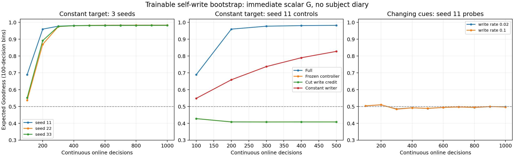

# ACNT 自修改启动训练：机制成立到哪一步

2026-10-01。**已实现并测试一个候选启动规则；它还不是可用的通用训练机制。**
它能学出对恒定目标有效的参数写入，但当前提示任务尚未学会。
这份结果与原版 original_online 的已知延迟成功分开报告。

后续 [信号链路诊断](self_write_input_diagnostic_2026-10-01.md) 已检查输入表示，
并增加零修改保持权重的增量写入对照；下文保留早期 target 写入结果。

## 实现与推导

原版前向保留。新增一个普通原版 Block，归入 Core，其 z 和有界
预激活 History 承载学习状态；新增 Write Adapter 生成实际写入。
只提供当前 Core 活动、已到达的标量 G 和自身动作，无外部经历账本、
目标标签、真实更新方向或动作关联表。

把被写行为参数 θ 纳入状态 X，使“过去写入 → 后续动作”可求导。
固定控制器参数 φ 时携带流式元敏感度 M：

\[
M_{t+1}=\partial_XF_\phi M_t+\partial_\phi F_\phi.
\]

从真实随机 Hand 动作得到控制器的条件策略信用 e。
即时 G 到达后，以 (G-0.5)e 小步上升训练接有 Write 的普通 Block/ReadIn/Write 的 φ。
这里 0.5 是固定参照，真实 G 原样进入该普通 Block；没有用反馈均值
代替主体的分析。行为参数 θ 的修改只能来自 Write 输出，启动训练不直接改 θ。

当前写入一块 Core 连接矩阵和一个 Hand 偏置，计 33 个参数；采用有界
低秩目标的凸组合。控制器普通出边进入行为 Block 的权重固定为零，
避免绕过写入。仅实现全激活同步实验核、Ear/Hand 两个行为 Adapter。
不是完整 Runtime 集成或任意参数自修改。

参见 [算法说明](../docs/training/SELF_WRITE_BOOTSTRAP.md)、
[实现](../acnt/self_write.py)、[实验](../experiments/self_write_online.py)。

## 验证

全库 **216 passed in 7.35s**。五个新增测试检查 canonical Core 前向
一致性、实际新权重参与前向、跨多次写入的导数与有限差分、切断写入
后行为信用消失，以及控制器更新不重置实际状态、资源大小固定。

固定 φ 时的条件轨迹导数检查通过。持续训练 φ 时仍使用 stop-outer-update
近似，且当前即时奖励更新没有纳入所有过去随机动作对未来反馈的影响。
不能称为完整终生回报的准确梯度。结构能求导与行为训练有效是两个检查。

## 行为结果

恒定目标任务：每次正确动作都是 1，但控制器不知道这个目标，只看到
动作后得到的 0/1 Goodness。每个 seed 1,000 次决策、4,000 个连续事件，
零重置、零重放、没有延迟反馈账本。最后 100 次决策结果：

| seed | 期望 G | 实际正确率 |
|---|---:|---:|
| 11 | 0.9837 | 0.97 |
| 22 | 0.9828 | 0.96 |
| 33 | 0.9816 | 0.96 |

三个运行均没有发生 M 范数截断。有限写入目标使性能存在上限；该任务
只说明标量反馈能启动一个有用写入器，不说明它学会了复杂反馈分析。

同一 seed 11，按第 401–500 次决策比较：

| 方法 | 期望 G |
|---|---:|
| 完整自修改训练 | 0.9820 |
| 冻结控制器，仍保留其写入 | 0.4082 |
| 保留写入数值，切断其训练信用 | 0.4082 |
| Write 只读常量，仍学习输出偏置 | 0.8274 |

冻结和切断信用对照是确定性相同的行为前缀，不算两个独立失败复现。
常量写入器也能学习，说明恒定目标不要求复杂内部记忆。完整方法更快，
但这项对照同时改变有效可训练参数数目，不能独立证明 H 必须存在。
1,000 次与 500 次运行的相同前缀也不算独立实验。

条件提示任务：Ear 提示每次随机改变，三事件后应据此选择 Hand 动作。
学习器只得到正确/错误的即时 G，没有得到提示的监督标签。
这是一个条件随输入变化的单任务，不是多个任务同时学习的实验。
seed 11、1,000 次决策，写入速率 0.02 的末段期望 G 为 **0.4984**，
没有学会。提高速率至 0.1 后末段期望 G 为 **0.4969**，同样没有学会，
因此单纯加快写入未解决这次失败。
这只是单 seed 失败证据，不能区分写入目标覆盖不足、控制器表示、
启动目标/信用估计或优化条件等原因。无需把未诊断的失败解释成隐状态
学习不可能，也不能用恒定目标成功覆盖这个失败。



## 资源与下一步判断

主体不读回实验日志。经历记忆在 Core 的 z/固定 History；当前参数直接
作为生效权重保留。除此之外，小模型训练器有固定数值 M 和两组更新矩。
526 个控制器参数、145 个联合状态标量，共 **309,868 字节**永久状态/
训练张量，不随经历时长增长。不包含网络参数、临时图/Jacobian 和旁观日志。
当前稠密实现不能直接扩展为大模型训练器。

这一步得到的是可运行、可否证的启动机制，不是“知道怎样训就必定训得会”。
下一阶段应先找到能稳定学会条件任务的参数写入接口与训练目标，再测试
任务切换、旧能力保留、迟到匿名 G 和更长的不重置轨迹。
模拟世界没有真实不可逆机械后果；不声称已验证终生稳定。

[精简结果及源码哈希](self_write_bootstrap_2026-10-01.json) 保存具体原始日志
路径、100 次分箱曲线、对照预算与资源。早期试验代码已保存到
`runs/self_write_online/source_snapshot/`，后续仅为实验入口增加写入速率参数。
摘要生成时核对当前或保存源码的 SHA256，禁止把不同源码混为同一版本。

```powershell
python -m experiments.summarize_self_write_online
```
